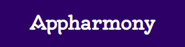

<h1 align="center">
 
</h1>

 
 

## :bookmark_tabs: Índice:

- [Descrição](#pagewithcurl-descrição)

- [Demonstração](#mega-demonstração)

- [Acessar](#door-acessar) 

- [Objetivos](#dart-objetivos)

- [Tecnologias Utilizadas](#heavycheckmark-tecnologias-utilizadas)

- [Bibliotecas Utilizadas](#books-bibliotecas-utilizadas)

- [Contribuidor](#grinning-contribuidor)

- [Desenvolvedor](#smiley-desenvolvedor)

## :scroll: Descrição:
Site interativo de uma startup desenvolvedora de aplicativos.

## :mega: Demonstração:
- Versão mobile 

 

 

- Versão tablet

 

 

- Versão desktop 

 
  
  
## :door: Acessar:
- Acesse o site em 

## :dart: Objetivos:
Projeto desenvolvido para aprender, exercitar, praticar e fixar conceitos de responsividade. 

## :heavy_check_mark: Tecnologias Utilizadas:
- HTML 5
- CSS 3

## :books: Bibliotecas Utilizadas:
- Ícones
  - Google Fonts (https://fonts.google.com/icons?icon.set=Material+Icons);
  - Icon Icons (https://icon-icons.com);
  - Icons8 (https://icons8.com); 

  

- Vídeo
  - Pixabay (https://pixabay.com);

 

- Animações
  - Animate.CSS (https://animate.style);

 

## :muscle: Contribuidor:
[ Matheus Alberto](https://github.com/ikyrie) || 
:-: | :-:  

## :smiley: Desenvolvedor:
[ Rogério Gauer](https://github.com/rogeriogauer)||
:-: | :-:     

